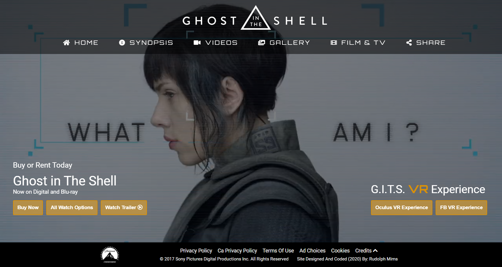

# Ghost in The Shell Movie (2017) Website Design
## Over View

Create a website for the live action movie "Ghost in The Shell" that was released in 2017. The site is to have the look a movie production studio would put out before a movie's release date with trailers of the movie, and image gallery. Also needs to have elements that the site would have once the movie is available for retail purchase, renting, and streaming.  

(Project initially started in 2020)
Initially the website was suppose to be kinda like a fansite. Going over what Ghost in The Shell is and contnet thats been created around it like the anime movies, anime series, video games and a time line of the movies/shows when they came out. 

### Screenshot

[Link to live project](https://gits-movie2020.netlify.app/index.html)

## Stack Used
- HTML CSS
- Javascript / ES6
- Fontawesome 5.13.0
- jQuery
## Things Learning / Practicing:
### Learning:
- JavaScript
- jQuery
### Practicing: 
- Site design / mockup
- HTML and CSS
## Helpful Links Below:
(To open url links in a new tab "CTRL" + Left Click)
### Light Box
Used for trailer video and image gallery
- [Vanilla JS FsLightbox](https://fslightbox.com/javascript)
### Site used for insparation:
- [Bloodshoot - Sony Pictures](https://www.sonypictures.com/movies/bloodshot)
- [Ghostbusters: Afterlife - Sony Pictures](https://www.sonypictures.com/movies/ghostbustersafterlife)
- [Ghostbusters.com - Sony Pictures](https://www.ghostbusters.com/)
- [Monster Hunter - Sony Pictures](https://www.sonypictures.com/movies/monsterhunter)
- [Sonic The Hedgehog - Paramount Movies](https://www.paramountmovies.com/movies/sonic-the-hedgehog)
- [Uncharted game](https://www.playstation.com/en-us/uncharted/)

### Reference content: 
(https://rewind.co/portfolio/ghost-in-the-shell-vr-experience/)
(https://www.oculus.com/experiences/gear-vr/1150151301762838/)
[Ghost in The Shell Wiki](https://ghostintheshell.fandom.com/wiki/Ghost_in_the_Shell_Wiki)
[Ghost in The Shell Interface - google search](https://www.google.com/search?q=ghost+in+the+shell+interface&tbm=isch&ved=2ahUKEwiL9d2m0ajrAhVHgZ4KHeWjCGUQ2-cCegQIABAA&oq=ghost+in+the+shell+interface&gs_lcp=CgNpbWcQAzICCAAyBggAEAgQHjIGCAAQCBAeOgQIIxAnOgQIABAYUL7SAVj44gFg4-0BaABwAHgAgAGeAYgBuwqSAQMwLjmYAQCgAQGqAQtnd3Mtd2l6LWltZ8ABAQ&sclient=img&ei=edI9X8vUIseC-gTlx6KoBg&bih=696&biw=1316&rlz=1C2CHBF_enUS746US746)
[Vimeo video](https://vimeo.com/147216124)
[Ghost in The Shell social media spots - Vimeo](https://vimeo.com/211386323)
[G.I.T.S. Instagram](https://www.instagram.com/ghostintheshell/)
[G.I.T.S. Twitter](https://twitter.com/GhostInShell)
[Florian Thamer - Freelance Motion Designer / CG Generalist](https://florianthamer.com/project/ghost-in-the-shell)